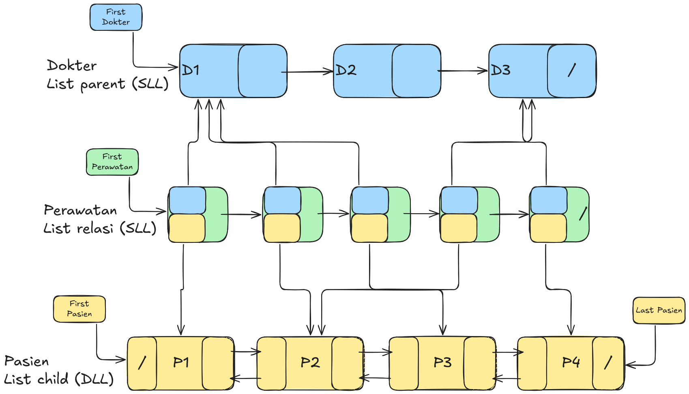

# Tugas Besar Struktur Data

<aside>
Kelompok 2M

Anggota Kelompok:

- Abdul Malik
- Putri Galuh Mandarizka
</aside>

# ❓ Deskripsi Masalah

Terdapat Rumah Sakit yang ingin menyimpan data pasien, dokter, dan juga perawatan yang menjadi relasi antara pasien dengan dokter tersebut. Struktur data list yang digunakan adalah *Multi Linked List*, dengan detail berikut:

- Data dokter menjadi **List Parent** yang bertipe *SLL (Single Linked List).*
- Data pasien menjadi **List Child** yang bertipe *DLL (Double Linked List).*
- Data perawatan menjadi **List Relasi** yang bertipe *SLL (Single Linked List)*, akan menghubungkan antara data dokter dengan pasien.
- Data dokter dengan pasien memiliki hubungan relasi ***M-N (Many to Many).***

# 📊 Visualisasi Multi Linked List

# 📝 Fitur-fitur Program

- List parent (Dokter)
    - Menambah dokter
    - Menghapus dokter
    - Mencari dokter
    - Menampilkan semua dokter
    - Menampilkan data dokter yang menangani pasien tertentu
    - Menampilkan data dokter tertentu beserta pasien yang ditanganinya. Ditampilkan beserta dengan data perawatannya
    - Menampilkan total pasien yang ditangani oleh dokter tertentu
    - Menampilkan total dokter yang tidak memiliki pasien
- List relasi (Perawatan)
    - Menambah data perawatan
    - Menghapus data perawatan
    - Mengedit dokter atau pasien dari data perawatan
- List child (Pasien)
    - Menambah pasien
    - Menghapus pasien
    - Mencari pasien
    - Menampilkan semua pasien
    - Menampilkan data pasien yang ditangani oleh dokter tertentu
    - Menampilkan data pasien tertentu beserta dokter yang menanganinya. Ditampilkan beserta dengan data perawatannya
    - Menampilkan total dokter yang menangani pasien tertentu
    - Menampilkan total pasien yang belum ditangani dokter
- Menemukan apakah data dokter dan pasien tertentu memiliki relasi

# 🚫 Kendala

- Penentuan untuk data parent dan child
- Penentuan prosedur last/first dalam mutasi data
- Implementasi kode terkait relasi parent ke child

# 🗒️ Pembagian Tugas

## Abdul Malik

Semua yang berkaitan dengan:

- List Parent (Data Dokter)
- List Relasi (Data Perawatan)
- Program utama

## Putri Galuh Mandarizka

Semua yang berkaitan dengan:

- List Child (Data Pasien)